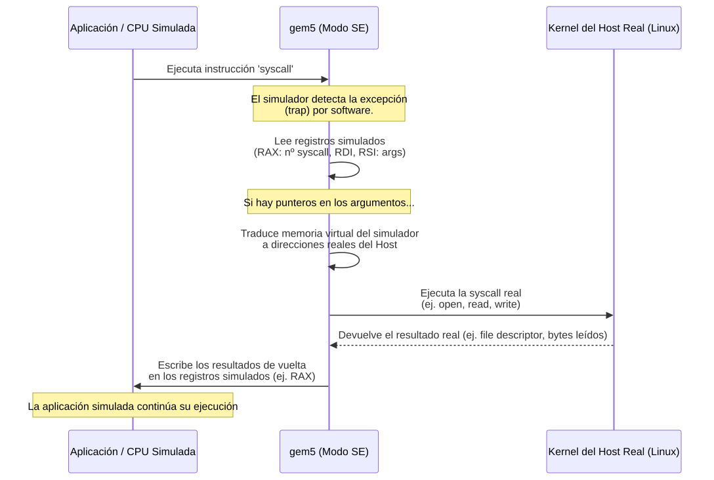

# Ideas para Diagramas de gem5 y Checkpointing

En este documento recopilaremos y dibujaremos las ideas para los diagramas conceptuales que explican la arquitectura de gem5 y el sistema de checkpointing.

## 1. Diagrama de Arquitectura Comparada (Full System vs Syscall Emulation)

Este diagrama clásico muestra la diferencia arquitectónica principal entre correr una aplicación simulando todo el hardware y el sistema operativo (FS), frente a emular únicamente las llamadas al sistema (SE).

## 2. Diagrama del Flujo de Intercepción de una Syscall en gem5 SE

Un flujo paso a paso de lo que ocurre exactamente cuando el código simulado necesita comunicarse con el sistema operativo (ej. leer un archivo, escribir en consola).

